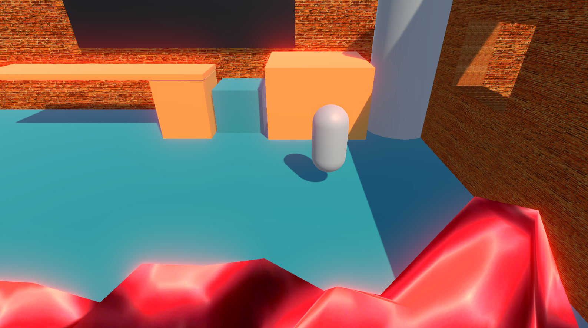
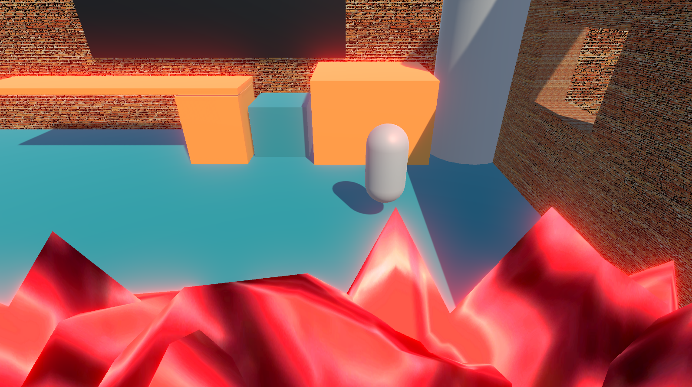
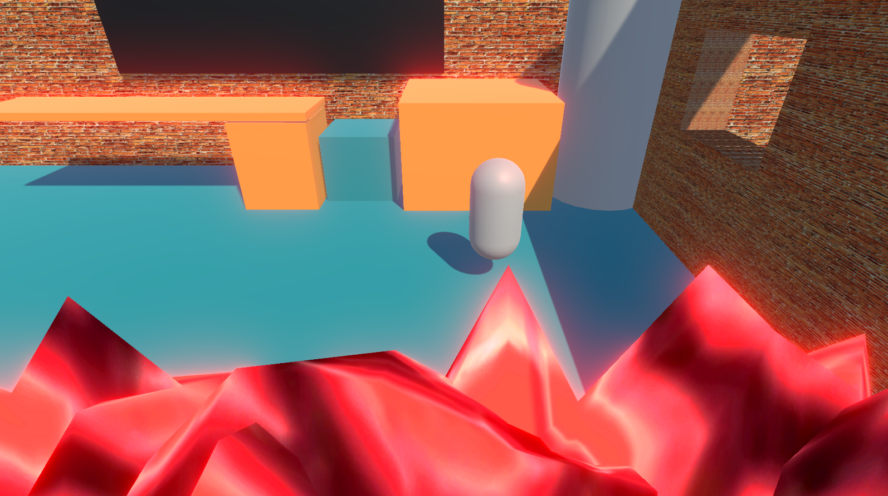
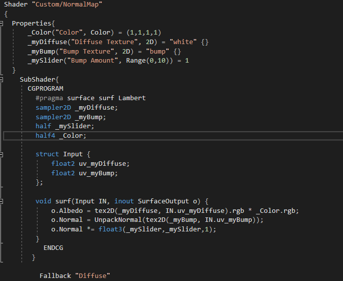
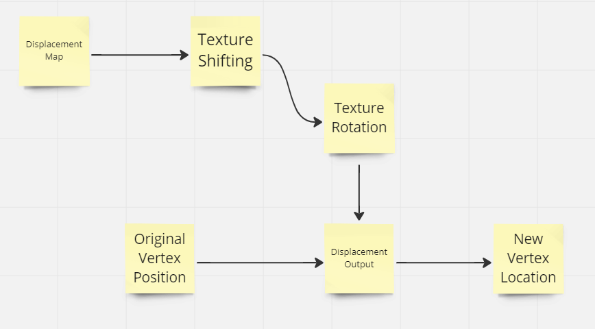
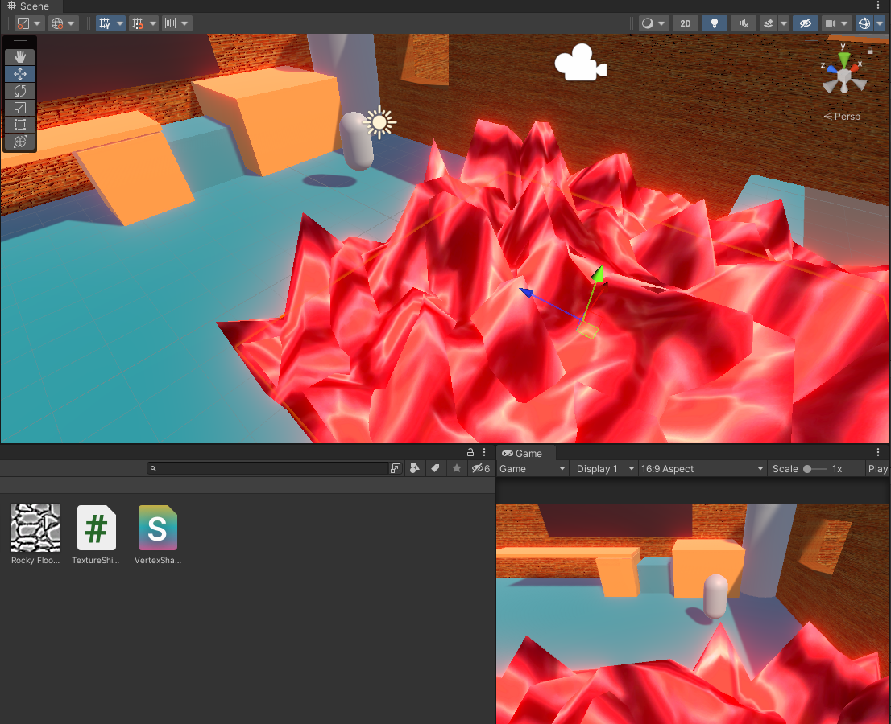
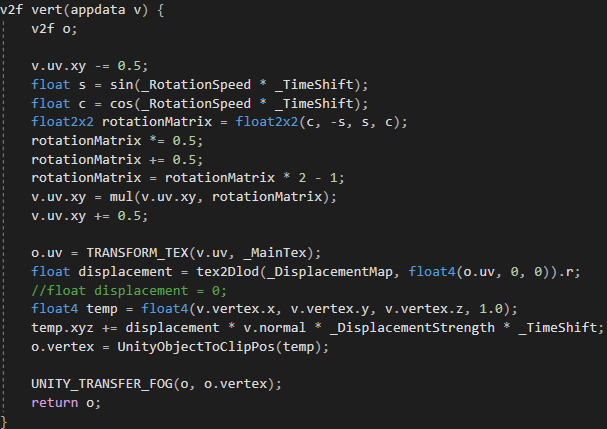
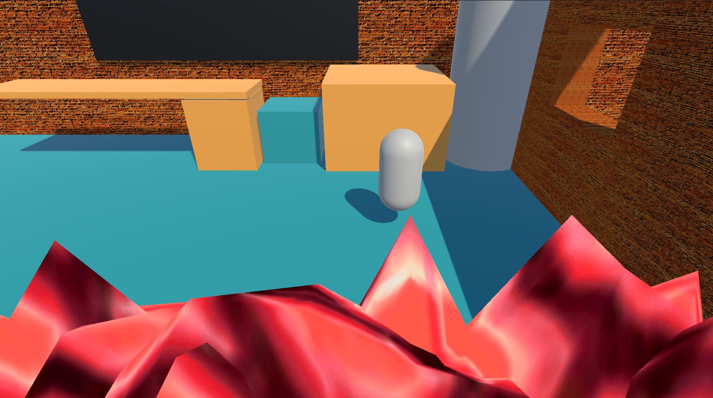
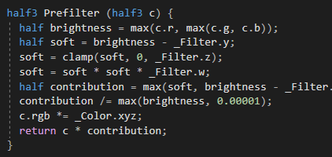

# Graphics-Final-Exam
 I made a mistake when rushing to complete the project and presumed that the odd and even numbers only referenced the last digit of our student number. As such I have completed the even side of for BOTH the practical and the theoretical portion (especially important for the theoretical question 4). Otherwise all of the completed content is done consistently based on the even sections.

The base scene ca be seens here, with the reference being from the even number section (100839332)
 

For the mappings shader used, a mormal map shader was used with a small modification to make the orange pop more. An extra color was imported into the base normal mapping shader and used to multiply with the texture rgb. This resulted with certain colors attaining their full value while others were caled back. This in turn can allow for the walls to pop more with orange then it would have before as a reference there will be pitures below showing the difference that the normal mapping and colors has on the walls. As for the base implementation of normal mapping, it take the original normals of the surface and inverts it to allow for a better contrast in light. This allows for 2d textures to look more realistic and 3d without having to displace and alter their positions.
No bump, no color
 
Bump, No color
 
Bump and color
 
 As for code explanation, the extras were as simple as importing color and multipling it by the rgb of the texture.
 

The implementation of the lava and spewing were a combonations of textue shifting and displacement maps. Displacement mapping was used to push lava up and down to imitate the fire effect. On top of that to imitate the randomness of the fire effect, both testure roation and shifting were used. In an external script you can control if the firs is more calm by pressing C and V to make the fire violently go. The script changes the shifting speed and roation of the of texture and displacement maps to imitate how fast it moves. The rotations is escpecially important to give fire a little more randomness as watching the fire go on a consistent cycle from right to left can affect the feel. As for the actual implementations of the shader, displacment shaders use vertex shading and recomputer where to render every vertex, allowing for the our effect to change based on the displacement map that isnt seen. This displacement maps says how much move the vertex vertically on the y axis to imitate the flame effects. The below flowchart may assist in uderstanding the logic. This happens for both the fires, as overlapping them seemed to gave a better visual effect.
 
 

 many sifnificant changes happening within the code of the original shader, namely the calculations of rotation done within the shader.
 

As for the bloom effect, it takes colors close to white and multiplies it into the surrounding tiles. This is done a number of time based on the amount of iterations set in the script. On top of that there are setting to limit the thereholds and intensity to get the right amount of bloom needed in a scene. As for the personal addition, I added mroe color to bloom effect. This was to really lean into the over the top lava effect and orangeness of the scene. By multipling in a color before the passes of bloom, the light effect will add a color glow rather than just a white glow. This really pops on the lava and the table tops giving the scene a brighter over the top orange effect, really hammering in the idea of the fire.

Without colored bloom
 
With colored bloom
 

The code change for bloom consisted of importing the color and multipling it in during the prefilter
 

